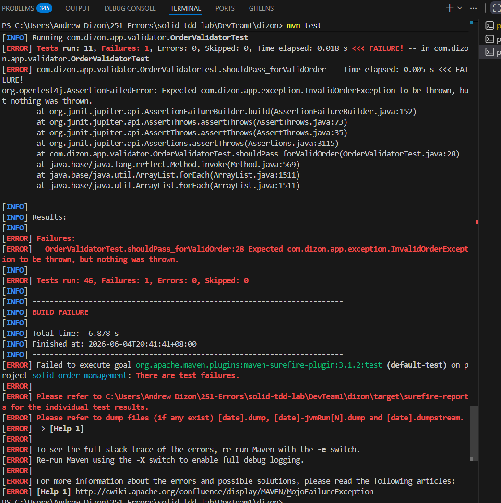
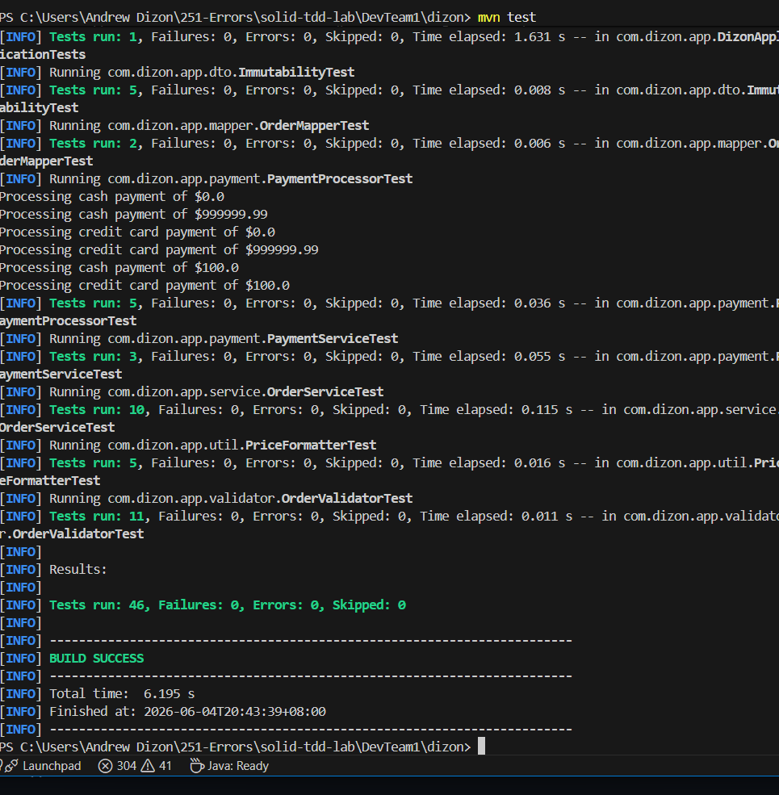

# Screenshots & TDD Evidence — Vic Andrew A. Dizon

Visual proof of the Red → Green → Blue TDD cycle and the SOLID refactor.

## 1. RED — failing test before the fix

A test in `OrderValidatorTest` was set to expect the wrong behaviour, producing
`Tests run: 46, Failures: 1` and `BUILD FAILURE`. This proves the test actually
exercises the validator — a test that can never fail proves nothing.

## 2. GREEN — all tests passing

With the validator behaving correctly, the full suite passes:
`Tests run: 46, Failures: 0, Errors: 0` — `BUILD SUCCESS`.

## 3. BLUE (Refactor) — clean code, still green

> **What the Blue phase is:** "Blue" is the nickname for the **Refactor** step of
> the Red → Green → Refactor cycle. It produces no new failures — its whole point is
> to **improve the design without changing behaviour**, proven by the fact that the
> *same green tests still pass afterward*. In this lab, the entire SOLID refactor **is**
> the Blue phase: the messy `OrderService` was split into single-responsibility classes,
> and all 46 tests remained green — so the structure changed, the behaviour did not.

The SOLID refactor keeps the suite green while improving the design.
Side-by-side of the messy original vs the refactored, single-responsibility version:

- BEFORE: [`../before/OrderService_BEFORE.java`](../before/OrderService_BEFORE.java) —
  `OrderService` did business logic **+** validation **+** mapping (one class, three jobs).
- AFTER: [`../after/OrderService_AFTER.java`](../after/OrderService_AFTER.java) —
  validation moved to `OrderValidatorImpl`, mapping to `OrderMapperImpl`;
  `OrderService` only orchestrates (SRP + DIP).

## 4. Full passing run (reference)

The complete Maven output (all 9 test classes, 46 tests) is in
[`../test-results/image.png`](../test-results/image.png).
