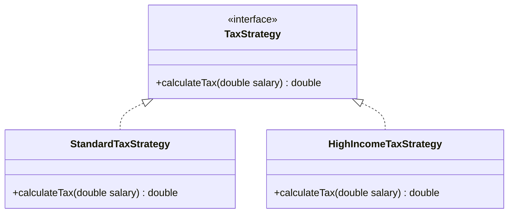

# SOLID + OOP Best Practices Refactoring Evidence

This document presents the detailed evidence of the refactoring completed for the Employee Management System, fulfilling all SOLID principles and OOP best practices.

---

## 📽️ System Demo (Web Flow Recording)

Below is the screen recording of the working frontend (Vite React) communicating with our refactored Spring Boot backend on port 8080. It demonstrates a complete CRUD cycle: adding an employee, editing their department and salary, and deleting them.


---

## 🧠 SOLID Principles

### 1. Single Responsibility Principle (SRP)

> [!NOTE]
> **Definition**: A class should have one, and only one, reason to change.
>
> **Problem**: Formerly, `EmployeeServiceImpl` was performing business validation (format validation, duplicate checks) and database updates.
>
> **Solution**: We extracted validation into [EmployeeValidator.java](file:///c:/Users/Bien%20Badosa/Desktop/251-Errors/solid-tdd-lab/DevTeam3/badosa/src/main/java/com/app/util/EmployeeValidator.java), making `EmployeeServiceImpl` focus strictly on transaction orchestration.

#### Before vs. After Refactoring (Conceptual Code Diff)

```diff
 // EmployeeServiceImpl.java
-public Employee createEmployee(EmployeeDTO dto) {
-    if (dto.getEmail() == null || !dto.getEmail().contains("@")) {
-        throw new IllegalArgumentException("Email is invalid");
-    }
-    if (repository.findByEmail(dto.getEmail()).isPresent()) {
-        throw new IllegalArgumentException("Email already in use");
-    }
-    if (dto.getSalary() <= 0) {
-        throw new IllegalArgumentException("Salary must be positive");
-    }
-    ...
-}
+public Employee createEmployee(EmployeeDTO dto) {
+    validator.validateForCreate(dto); // Delegated to specialized validator
+    Employee employee = dto.toEntity();
+    return repository.save(employee);
+}
```

---

### 2. Open-Closed Principle (OCP)

> [!TIP]
> **Definition**: Software entities should be open for extension, but closed for modification.
>
> **Problem**: `SalaryCalculator` formerly had hardcoded conditional logic for computing standard/high tax rates. Adding a new tax bracket meant modifying the class.
>
> **Solution**: We created a [TaxStrategy.java](file:///c:/Users/Bien%20Badosa/Desktop/251-Errors/solid-tdd-lab/DevTeam3/badosa/src/main/java/com/app/util/TaxStrategy.java) interface and two implementations: [StandardTaxStrategy.java](file:///c:/Users/Bien%20Badosa/Desktop/251-Errors/solid-tdd-lab/DevTeam3/badosa/src/main/java/com/app/util/StandardTaxStrategy.java) and [HighIncomeTaxStrategy.java](file:///c:/Users/Bien%20Badosa/Desktop/251-Errors/solid-tdd-lab/DevTeam3/badosa/src/main/java/com/app/util/HighIncomeTaxStrategy.java). The calculator now accepts a strategy polymorphically.

#### Strategy Implementation Structure



---

### 3. Liskov Substitution Principle (LSP)

> [!IMPORTANT]
> **Definition**: Subtypes must be substitutable for their base types without altering correctness.
>
> **Solution**: Both `StandardTaxStrategy` and `HighIncomeTaxStrategy` obey the identical contractual constraints of `TaxStrategy`. For example, they handle invalid input consistently by throwing `IllegalArgumentException` when receiving a negative salary.

#### LSP Unit Test Proof

```java
// TaxStrategyTest.java
@Test
void testTaxStrategiesThrowOnNegativeSalary() {
    TaxStrategy standard = new StandardTaxStrategy();
    TaxStrategy high = new HighIncomeTaxStrategy();

    assertThrows(IllegalArgumentException.class, () -> standard.calculateTax(-100));
    assertThrows(IllegalArgumentException.class, () -> high.calculateTax(-100));
}
```

---

### 4. Interface Segregation Principle (ISP)

> [!NOTE]
> **Definition**: Clients should not be forced to depend on methods they do not use.
>
> **Problem**: `EmployeeService` was a "fat" interface containing both queries (read) and commands (write).
>
> **Solution**: We segregated it into [EmployeeQueryService.java](file:///c:/Users/Bien%20Badosa/Desktop/251-Errors/solid-tdd-lab/DevTeam3/badosa/src/main/java/com/app/service/EmployeeQueryService.java) and [EmployeeCommandService.java](file:///c:/Users/Bien%20Badosa/Desktop/251-Errors/solid-tdd-lab/DevTeam3/badosa/src/main/java/com/app/service/EmployeeCommandService.java). Controllers now inject only the interface they need.

```java
// EmployeeController.java
public class EmployeeController {
    private final EmployeeQueryService queryService;
    private final EmployeeCommandService commandService;

    public EmployeeController(EmployeeQueryService queryService, EmployeeCommandService commandService) {
        this.queryService = queryService;
        this.commandService = commandService;
    }
    // ...
}
```

---

### 5. Dependency Inversion Principle (DIP)

> [!TIP]
> **Definition**: High-level modules should not depend on low-level modules; both should depend on abstractions.
>
> **Solution**: Low-level details (like specific email notifications or database interactions) are decoupled via interfaces. `EmployeeServiceImpl` is constructed using interface variables `EmployeeRepository` and `NotificationService` rather than concrete classes.

---

## 💎 OOP Best Practices

### 1. Composition Over Inheritance

We avoided inheriting from multiple classes to represent specialized employee types (e.g. `SalariedEmployee`). Instead, the [Employee.java](file:///c:/Users/Bien%20Badosa/Desktop/251-Errors/solid-tdd-lab/DevTeam3/badosa/src/main/java/com/app/entity/Employee.java) domain entity uses a **HAS-A** relationship composed with an embeddable [SalaryDetails.java](file:///c:/Users/Bien%20Badosa/Desktop/251-Errors/solid-tdd-lab/DevTeam3/badosa/src/main/java/com/app/entity/SalaryDetails.java) value object.

```java
// Employee.java
@jakarta.persistence.Embedded
private SalaryDetails salaryDetails;
```

---

### 2. Immutability

- **`SalaryDetails`**: Has no setters, and all fields are marked `final`. Once created, its base salary and allowance amounts cannot be mutated, protecting financial data records.
- **`EmployeeDTO`**: Decorates input payloads with Lombok's `@Value` annotation, rendering the transfer object completely immutable.

#### Immutability Test Case

```java
// ImmutabilityTest.java
@Test
void testSalaryDetailsImmutability() {
    // Assert fields are final and no setters exist
    Class<SalaryDetails> clazz = SalaryDetails.class;
    for (var field : clazz.getDeclaredFields()) {
        if (!field.getName().equals("$jacocoData")) { // Ignore test coverage instruments
            assertTrue(java.lang.reflect.Modifier.isFinal(field.getModifiers()), 
                "Field " + field.getName() + " must be final");
        }
    }
}
```

---

## 🧪 Unit Testing Results

All unit tests pass successfully. The project includes **26 tests** validating calculations, immutability, SRP validators, LSP strategies, mock database repositories, and edge case parameters.

```text
[INFO] Results:
[INFO] 
[INFO] Tests run: 26, Failures: 0, Errors: 0, Skipped: 0
[INFO] 
[INFO] ------------------------------------------------------------------------
[INFO] BUILD SUCCESS
[INFO] ------------------------------------------------------------------------
```

### Test Coverage Table

| Class | Tested Behavior | Verification Type |
| :--- | :--- | :--- |
| `EmployeeValidatorTest` | Invalid formats, duplicates, negative salary values | Exception asserting, mocks |
| `TaxStrategyTest` | Standard/High strategy math accuracy and LSP equivalence | Assertion checks, edge cases |
| `ImmutabilityTest` | Validating DTOs and `SalaryDetails` are final | Reflection inspection |
| `EmployeeServiceImplTest` | CRUD mocks, validator coordination, events propagation | Mockito verifies |
| `NotificationServiceTest` | SMS and Email channel dispatching logic | Polymorphic verification |
| `SalaryCalculatorTest` | Correct strategies mapping and math calculation | Strategy execution checks |
